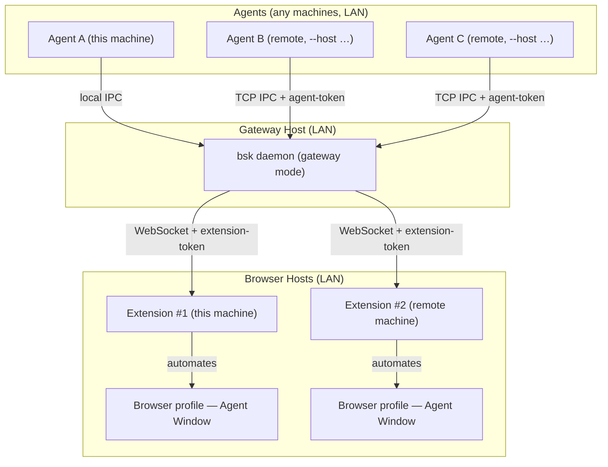

# MultiAgent-BrowserSkill

<p align="center">
  
</p>

<p align="center">
  <strong>Let many AI agents drive your browsers over the LAN — without interrupting your work.</strong>
</p>

<p align="center">
  English · <a href="README.zh-CN.md">中文</a>
</p>

**MultiAgent-BrowserSkill** is a gateway-shaped fork of
[Tencent/BrowserSkill](https://github.com/Tencent/BrowserSkill) (MIT). It turns
the local bridge between AI agents and your browser into a **LAN gateway /
broker**: multiple agents on multiple machines can share multiple browsers
across hosts — while still fully supporting the original single-machine mode.

Agents connect to a gateway daemon over authenticated TCP IPC; browser
extensions on any host dial back to the same daemon over authenticated
WebSocket. No SSH, no credentials stored on the gateway host, no lock-in to a
specific agent framework.

Need the agent to touch a tab you already have open? It must borrow that tab
explicitly, return it when the task is done, and leave the rest of your browser
alone.

## What's new in this fork

| Capability | Description |
| --- | --- |
| **Multi-agent × multi-browser gateway** | One daemon on a LAN host; remote CLI peers (agents) connect over TCP IPC, browser extensions register over outbound WebSocket. Many-to-many, no SSH. |
| **Token authentication** | Two token roles: `--agent-token` (full control for remote CLIs) and `--extension-token` (register-only for browser extensions). Tokens are exchanged in the first handshake frame — never in the URL / query string. |
| **Protocol 1.2** | Handshake carries `agent_id` + token; Busy semantics and session ownership are part of the wire protocol, with `MIN_COMPATIBLE_PROTOCOL = 1.0` for graceful upgrades. |
| **LAN CIDR allow-list** | Optional `--lan-cidr` (repeatable) / `BSK_LAN_CIDRS` env scopes which source networks may talk to the daemon at all. Peer source-IP is checked **before** any handshake on both TCP and WebSocket entry points. Nothing hard-coded; operators configure their own networks (Tailscale CGNAT `100.64.0.0/10`, home `192.168.x.0/24`, …). |
| **Gateway auto-listen** | `bsk daemon start --gateway` without `--listen` probes the host's interfaces and picks a LAN-reachable address — Tailscale interface first, then a network inside the configured CIDRs, then any non-loopback, with loopback as safe fallback. |
| **Busy semantics + session ownership** | A session records the owning `agent_id`; another agent hitting the same browser gets `session_busy` instead of silently hijacking. `--share` is the explicit override. Same agent is allowed concurrent sessions. |
| **Safety interlocks** | Non-loopback binds *require* a configured token (daemon refuses to start otherwise); gateway mode disables idle self-shutdown, auto-spawn and auto-update. `::1` loopback and IPv4-mapped IPv6 peers are handled correctly in the CIDR gate. |
| **Remote CLI** | `bsk --host <ip> --port <port> --agent-token <token> …` (or `BSK_AGENT_TOKEN` env). Remote mode never auto-spawns a local daemon; admin commands (`daemon start/stop/restart`) are refused remotely — gateway lifecycle belongs to the gateway host. |
| **Configurable extension endpoints** | The popup can set the daemon address + extension token (`ws://` validation, token field masked), reconnect at runtime without reloading the extension. |

The original single-machine experience is unchanged: `bsk daemon start` binds
loopback by default, same-host CLI via local IPC, local extension via `ws://127.0.0.1`.

## BrowserSkill Advantages (inherited)

- **Reuse real login state**: Agents can work with sites you are already signed
  into, without separate test accounts.
- **Keep working uninterrupted**: browser tasks run in a separate, visible
  Agent Window, so you can keep using your own browser.
- **Support any Agent**: any Agent that can call a shell can use it through the
  `bsk` CLI, with no lock-in to a specific model, Agent framework, or harness.
- **Built-in human-in-loop**: when a task hits captcha, login, confirmation
  dialogs, or other human-only steps, the Agent can ask you to take over and
  then continue afterwards.

## Runtime Environment

Two runtime pieces: the `bsk` CLI/daemon (the gateway) and the browser extension.

| Runtime | Support |
| --- | --- |
| Operating systems | macOS (Apple Silicon and Intel), Linux (x64 and ARM64), Windows x64 |
| Browsers | Chrome and Microsoft Edge are supported; other Chromium-based browsers are expected to work when they support unpacked Chromium extensions; Firefox is planned |

## Multi-agent Gateway Architecture



- The agent never talks to the browser directly. It asks the `bsk` CLI to perform
  a browser task; the gateway daemon routes the request to a registered browser
  extension; the extension runs it in an Agent Window.
- Extensions **dial out** to the daemon (no inbound firewall holes on browser
  hosts); remote agents dial the daemon's TCP IPC port (one port per gateway).
- The gateway host holds **no browser-host credentials** — token exchange happens
  at connection time, in the handshake frame.

## Security Model

- **Tokens never appear in URLs** — sent in the first handshake frame over TCP
  and WebSocket.
- **Two roles**: `agent_token` = full control (remote CLI), `extension_token` =
  register-only (browser extension).
- **Interlock**: binding a non-loopback address without the matching token is a
  startup error, not a warning. Gateway mode additionally disables idle
  self-shutdown, daemon auto-spawn and auto-update.
- **Optional LAN CIDR allow-list**: when configured, peers whose source IP is
  outside the list are dropped before handshake (both TCP and WebSocket entry
  points). Loopback (`127.0.0.1`, `::1`) is always allowed; IPv4-mapped IPv6
  peers are unmapped and matched as IPv4.
- **Honest defaults**: as a convention, Busy/session-ownership relies on
  agents sending a truthful `--agent-id`. For strong isolation across trust
  domains, issue a separate token per trust domain — do not share one
  agent-token across domains.

## Quick Start (build from source)

> This fork is not distributed via the Chrome Web Store; load the extension as
> an unpacked extension from `apps/extension` builds.

#### 1. Build the `bsk` CLI

Requires Rust (Cargo) ≥ 1.98.

```bash
git clone https://github.com/Mirr0ch1/MultiAgent-BrowserSkill.git
cd MultiAgent-BrowserSkill
cargo build --release -p bsk
# binary at target/release/bsk — add target/release to your PATH
bsk --version
```

#### 2. Build & load the browser extension

Requires Node.js + pnpm.

```bash
cd apps/extension
pnpm install
pnpm build
```

Then open `chrome://extensions` (or `edge://extensions`), enable **Developer
mode**, choose **Load unpacked**, and select `apps/extension/dist/chrome-mv3`.

#### 3. Install the skill into your agent harness

```bash
bsk install-skill
```

Use <kbd>Space</kbd> to select the agent harness to install into. Other
shell-capable agent harnesses: copy [`skill/SKILL.md`](skill/SKILL.md) into your
harness's skills directory as `browser-skill/SKILL.md`.

#### 4. Use it

Start a new agent session and write a prompt that needs the browser, for
example:

```text
/browser-skill open example.com and summarize what is on the page.
```

## Single-machine mode (default)

```bash
bsk daemon start        # loopback daemon, local CLI, local extension
bsk browsers            # list connected browsers
bsk navigate --url https://example.com
```

## Gateway mode (multi-agent × multi-host)

On the **gateway host** (a machine reachable on your LAN / Tailscale):

```bash
bsk daemon start --gateway \
  --lan-cidr 100.64.0.0/10 \        # Tailscale CGNAT (optional, repeatable)
  --lan-cidr 192.168.10.0/24 \      # your LAN subnet (optional, repeatable)
  --agent-token "$AGENT_TOKEN" \
  --extension-token "$EXT_TOKEN"
```

On any **browser host**, point the extension at the gateway and set the
extension token in the popup (Connection settings).

From any **agent machine**:

```bash
BSK_AGENT_TOKEN="$AGENT_TOKEN" bsk --host <gateway-ip> --port <ws-port> browsers
BSK_AGENT_TOKEN="$AGENT_TOKEN" bsk --host <gateway-ip> --port <ws-port> --agent-id openclaw:main navigate --url https://example.com
```

Notes for gateway mode:

- Always pass `--agent-id <agent-name>` so session ownership and Busy semantics
  are correct across agents.
- Add `--lan-cidr` entries for every network your peers come from; the daemon
  refuses connections from outside the allow-list.
- Never share one `--agent-token` across trust domains.
- `--share` on a session start explicitly overrides Busy for shared browsers.

## CLI Overview

```
Usage: bsk [OPTIONS] <COMMAND>

Commands:
  daemon        Manage the daemon process (start/stop/restart/status)
  status        Show daemon status
  doctor        Diagnostics + repair hints (works remotely too)
  install-skill Install the agent skill into local harnesses
  update        Check for/install CLI updates (refused for gateway daemons)
  logs          Print (and optionally follow) the daemon log file
  session       Session lifecycle (start/cancel/…) with --agent-id and --share
  browsers      List connected browsers (with agent ownership info)
  tab           Tab management
  window        Agent Window management
  emulate       Mobile device emulation (viewport, UA, touch)
  screenshot    Capture a PNG of the active tab or a snapshot ref element
  snapshot      Produce an indented aria-snapshot with @eN refs
  observe       Produce a semantic VOM observation with perception probes
  console       Read buffered console/log/exception messages
  network       Read buffered network responses / failures
  get-html      Dump raw HTML for a tab or a snapshot ref
  navigate      Navigate the Agent Window's tab to a URL
  navigate-back / navigate-forward / reload
  click / hover / fill / press / select / upload / download / evaluate
  wait-for-navigation

Global flags (gateway mode):
  --host <ip>         Connect to a remote gateway (instead of local daemon)
  --port <port>       Gateway WS port
  --agent-token <tok> Remote auth token (or BSK_AGENT_TOKEN env)
```

## For Developers

The repository is a Cargo + pnpm workspace:

- `crates/bsk-cli` — `bsk` CLI and daemon (IPC, gateway, tokens, CIDR gate)
- `crates/bsk-protocol` — shared wire types, protocol versioning, handshake
- `apps/extension` — browser extension (popup connection settings, transport)
- `packages/ui` and `packages/i18n` — shared extension UI support
- [`evals/browser`](evals/browser/README.md) — deterministic local pages and
  agent-neutral browser capability evaluation

Tests: `cargo test -p bsk -- --test-threads=1` (unit + integration, including
`gateway_*` suites) and `cd apps/extension && pnpm test`.

## Upstream & License

This project is a fork of [Tencent/BrowserSkill](https://github.com/Tencent/BrowserSkill)
adding multi-agent gateway capabilities. The original MIT license is preserved
in [`LICENSE`](LICENSE); both the upstream project and this fork are MIT.