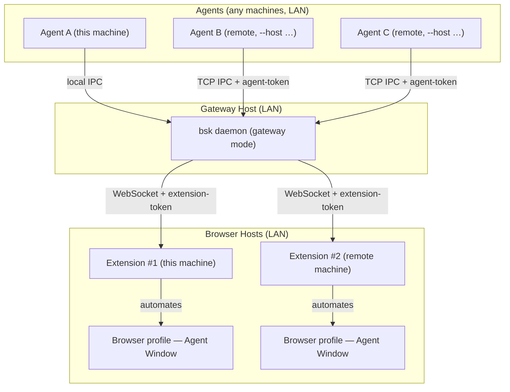

# MultiAgent-BrowserSkill

<p align="center">
  
</p>

<p align="center">
  <strong>让多个 AI Agent 通过局域网驱动多台浏览器的网关 —— 不打断你的工作。</strong>
</p>

<p align="center">
  <a href="README.md">English</a> · 中文
</p>

**MultiAgent-BrowserSkill** 是 [Tencent/BrowserSkill](https://github.com/Tencent/BrowserSkill)
（MIT）的网关化 fork。它把「AI Agent 与浏览器之间的本地桥」升级为**局域网网关 / broker**：
多台机器上的多个 Agent 可以共享多台主机上的多个浏览器 —— 同时完整保留原版单机模式。

Agent 通过带认证的 TCP IPC 连接网关 daemon；任意主机上的浏览器扩展通过带认证的
WebSocket 主动回连同一 daemon。不需要 SSH、网关主机不保存任何浏览器主机凭据、不锁定
任何特定 Agent 框架。

Agent 想碰你已打开的标签页？它必须显式借用、用完归还，其余浏览器内容一概不碰。

## 本 fork 新增能力

| 能力 | 说明 |
| --- | --- |
| **多 Agent × 多浏览器网关** | 一台 LAN 主机跑 daemon；远程 CLI（Agent）走 TCP IPC 连接，浏览器扩展走主动出站 WebSocket 注册。多对多，无需 SSH。 |
| **Token 认证** | 两种角色：`--agent-token`（远程 CLI 全权）与 `--extension-token`（浏览器扩展仅注册）。Token 只在首帧握手交换，**绝不进 URL / query string**。 |
| **协议 1.2** | 握手携带 `agent_id` + token；Busy 语义与会话归属成为线上协议的一部分，`MIN_COMPATIBLE_PROTOCOL = 1.0` 保证平滑升级。 |
| **局域网 CIDR 白名单** | 可选 `--lan-cidr`（可重复）/ `BSK_LAN_CIDRS` 环境变量，限制哪些来源网段能连 daemon。TCP 与 WebSocket 两个入口都在**握手之前**按来源 IP 检查。不硬编码，运营者自己配（Tailscale `100.64.0.0/10`、家庭 `192.168.x.0/24` 等）。 |
| **网关自动监听** | `bsk daemon start --gateway` 不带 `--listen` 时自动探测网卡选 LAN 可达地址——Tailscale 接口优先 → 配置 CIDR 内的网卡 → 任意非 loopback → loopback 兜底。 |
| **Busy 语义 + 会话归属** | 会话记录所属 `agent_id`；其他 Agent 命中同一浏览器得到 `session_busy` 而不是静默抢占。`--share` 是显式覆盖。同一 Agent 允许多并发会话。 |
| **安全互锁** | 非 loopback 绑定**必须**配 token（否则拒绝启动）；网关模式禁用 idle 自关、自动 spawn、自动 update。CIDR 门正确处理 `::1` 与 IPv4-mapped IPv6。 |
| **远程 CLI** | `bsk --host <ip> --port <port> --agent-token <token> …`（或 `BSK_AGENT_TOKEN` 环境变量）。远程模式绝不自动 spawn 本地 daemon；admin 命令（`daemon start/stop/restart`）远程拒绝——网关生命周期归网关机管。 |
| **扩展端点可配置** | popup 可设置 daemon 地址 + 扩展 token（`ws://` 校验、token 输入掩码），运行时可重连，无需重载扩展。 |

原版单机体验不变：默认 `bsk daemon start` 绑 loopback，本机 CLI 走本地 IPC，本机扩展走
`ws://127.0.0.1`。

## BrowserSkill 既有优势（继承）

- **复用真实登录态**：Agent 能操作你已登录的站点，无需单独的测试账号。
- **互不打扰**：浏览器任务跑在独立的可见 Agent Window，你可以继续用自己的浏览器。
- **适配任意 Agent**：任何能调 shell 的 Agent 都能通过 `bsk` CLI 使用，不绑定具体模型或框架。
- **内置人工介入**：遇到验证码、登录、确认弹窗等人工步骤时，Agent 可以请你接管，完成后继续。

## 运行环境

两个运行时：`bsk` CLI/daemon（网关）与浏览器扩展。

| 运行时 | 支持 |
| --- | --- |
| 操作系统 | macOS（Apple Silicon / Intel）、Linux（x64 / ARM64）、Windows x64 |
| 浏览器 | Chrome 与 Microsoft Edge；其他支持未打包扩展的 Chromium 系浏览器预期可用；Firefox 规划中 |

## 多 Agent 网关架构



- Agent 从不直接跟浏览器对话：它请 `bsk` CLI 执行浏览器任务 → 网关 daemon 路由到已注册的
  扩展 → 扩展在 Agent Window 里执行。
- 扩展**主动出站**连 daemon（浏览器主机无需开放入站防火墙）；远程 Agent 只连 daemon 的
  TCP IPC 端口（每网关一个端口）。
- 网关主机**不持有任何浏览器主机凭据**——Token 在连接时于握手帧内交换。

## 安全模型

- **Token 不进 URL**：TCP 与 WebSocket 都在首帧握手发送。
- **两种角色**：`agent_token` = 全权（远程 CLI）；`extension_token` = 仅注册（浏览器扩展）。
- **互锁**：非 loopback 绑定不配对应 token = 启动错误，不是警告。网关模式额外禁用 idle
  自关、daemon 自动 spawn、自动 update。
- **可选 LAN CIDR 白名单**：配置后，来源 IP 不在名单内的 peer 在握手前被丢弃（TCP 与
  WS 两个入口）。loopback（`127.0.0.1`、`::1`）永远放行；IPv4-mapped IPv6 解映射后按
  IPv4 匹配。
- **诚实默认**：作为约定，Busy/会话归属依赖 Agent 如实发送 `--agent-id`。跨信任域强隔离
  时请按信任域单独签发 token，不要跨域共享同一个 agent-token。

## 快速开始（源码构建）

> 本 fork 不走 Chrome Web Store；从 `apps/extension` 构建后以「加载已解压的扩展程序」安装。

#### 1. 构建 `bsk` CLI

需要 Rust（Cargo）≥ 1.98。

```bash
git clone https://github.com/Mirr0ch1/MultiAgent-BrowserSkill.git
cd MultiAgent-BrowserSkill
cargo build --release -p bsk
# 二进制在 target/release/bsk —— 把 target/release 加进 PATH
bsk --version
```

#### 2. 构建并加载浏览器扩展

需要 Node.js + pnpm。

```bash
cd apps/extension
pnpm install
pnpm build
```

然后打开 `chrome://extensions`（或 `edge://extensions`），开启**开发者模式**，选择
**加载已解压的扩展程序**，选中 `apps/extension/dist/chrome-mv3`。

#### 3. 把 skill 装进你的 Agent harness

```bash
bsk install-skill
```

用 <kbd>空格</kbd> 选择要安装的 harness。其他支持 shell 的 harness：把
[`skill/SKILL.md`](skill/SKILL.md) 复制到 harness 的 skills 目录，命名为
`browser-skill/SKILL.md`。

#### 4. 使用

新开一个 Agent 会话并写需要浏览器的提示词，例如：

```text
/browser-skill open example.com and summarize what is on the page.
```

## 单机模式（默认）

```bash
bsk daemon start        # loopback daemon，本机 CLI，本机扩展
bsk browsers            # 列出已连接的浏览器
bsk navigate --url https://example.com
```

## 网关模式（多 Agent × 多主机）

在**网关机**上（LAN / Tailscale 可达的机器）：

```bash
bsk daemon start --gateway \
  --lan-cidr 100.64.0.0/10 \        # Tailscale CGNAT（可选，可重复）
  --lan-cidr 192.168.10.0/24 \      # 你的局域网段（可选，可重复）
  --agent-token "$AGENT_TOKEN" \
  --extension-token "$EXT_TOKEN"
```

在任意**浏览器主机**上，把扩展指向网关并在 popup 的 Connection 设置里填入扩展 token。

从任意 **Agent 机器**：

```bash
BSK_AGENT_TOKEN="$AGENT_TOKEN" bsk --host <gateway-ip> --port <ws-port> browsers
BSK_AGENT_TOKEN="$AGENT_TOKEN" bsk --host <gateway-ip> --port <ws-port> --agent-id openclaw:main navigate --url https://example.com
```

网关模式注意事项：

- 每次调用带 `--agent-id <agent-name>`，跨 Agent 的会话归属与 Busy 语义才正确。
- 为每个 peer 来源网段加一条 `--lan-cidr`；白名单外的连接会被拒绝。
- 不要跨信任域共享同一个 `--agent-token`。
- 会话开始时 `--share` 显式覆盖 Busy，用于共享浏览器。

## CLI 概览

```
Usage: bsk [OPTIONS] <COMMAND>

Commands:
  daemon        管理 daemon 进程（start/stop/restart/status）
  status        查看 daemon 状态
  doctor        诊断 + 修复提示（远程也可用）
  install-skill 安装 skill 到本地 harness
  update        检查/安装 CLI 更新（网关 daemon 拒绝）
  logs          打印（可选 follow）daemon 日志
  session       会话生命周期（start/cancel/…），支持 --agent-id 与 --share
  browsers      列出已连接浏览器（含 agent 占用信息）
  tab           标签页管理
  window        Agent Window 管理
  emulate       移动设备模拟（viewport、UA、touch）
  screenshot    截图当前标签页或 snapshot ref
  snapshot      生成带 @eN refs 的缩进 aria-snapshot
  observe       生成带感知探针的语义 VOM 观察
  console       读缓冲的 console/log/exception 消息
  network       读缓冲的网络响应/失败
  get-html      导出标签页或 ref 的原始 HTML
  navigate      让 Agent Window 导航到 URL
  navigate-back / navigate-forward / reload
  click / hover / fill / press / select / upload / download / evaluate
  wait-for-navigation

全局 flag（网关模式）：
  --host <ip>         连接远程网关（替代本地 daemon）
  --port <port>       网关 WS 端口
  --agent-token <tok> 远程认证 token（或 BSK_AGENT_TOKEN 环境变量）
```

## 开发者

仓库是 Cargo + pnpm workspace：

- `crates/bsk-cli` — `bsk` CLI 与 daemon（IPC、网关、token、CIDR 门）
- `crates/bsk-protocol` — 线上类型、协议版本、握手
- `apps/extension` — 浏览器扩展（popup 连接设置、传输层）
- `packages/ui` 与 `packages/i18n` — 扩展共享 UI
- [`evals/browser`](evals/browser/README.md) — 确定性本地页面与 Agent 无关的浏览器能力评测

测试：`cargo test -p bsk -- --test-threads=1`（单元 + 集成，含 `gateway_*` 系列）与
`cd apps/extension && pnpm test`。

## 上游与开源许可

本项目是 [Tencent/BrowserSkill](https://github.com/Tencent/BrowserSkill) 的 fork，新增多
Agent 网关能力。原始 MIT 许可保留在 [`LICENSE`](LICENSE)；上游与本 fork 均为 MIT。